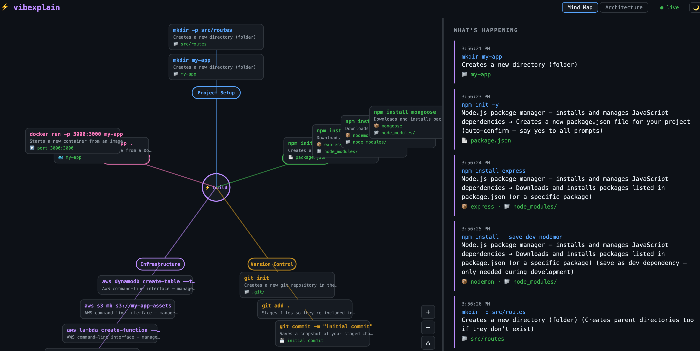
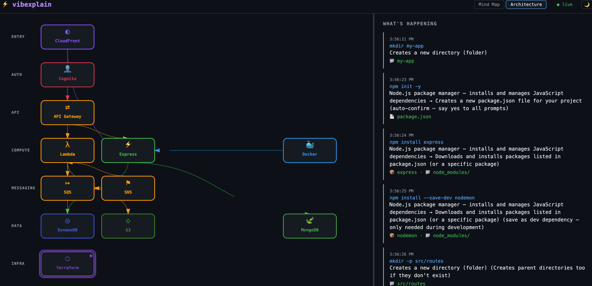

# ⚡ vibexplain

See what your AI coding agent is actually doing in real time.

A live dashboard that watches your project, explains every change in plain English, and draws the architecture as it's being built — works with any AI coding tool.

  

---

## The problem

You tell an AI agent to "build me a serverless API with auth" and it starts running commands. Dozens of them. You see terminal output scrolling by, but:

- What did it just create?
- Why did it install that package?
- What services are being wired together?
- Is this thing building what I actually asked for?

**vibexplain answers all of that**, live, as it happens.

### Mind Map


### Architecture


## Prerequisites

- [Node.js](https://nodejs.org/) v18 or later (includes npm)

To check if you have it:

```bash
node -v   # should print v18.x or higher
npm -v    # should print a version number
```

If not installed, download it from [nodejs.org](https://nodejs.org/) — the LTS version is recommended.

## Install

```bash
npm install -g vibexplain
```

No `npm login` required — this is a public package.

## How it works

vibexplain uses a layered detection system that automatically picks the best strategy for your tool:

```
vibexplain starts
  ├── Scanner        → bootstraps dashboard from existing project state
  ├── File watcher   → detects live changes (works with every agent)
  └── Claude Code    → tails JSONL session transcripts for exact commands
      tailer           (auto-detected, zero config)
```

| Layer | What it does | Works with |
|---|---|---|
| **Scanner** | Reads git history, package.json, Terraform/Serverless/CDK files. Extracts real resource names. Pre-populates the dashboard instantly. | Everything |
| **File watcher** | Monitors your project for new files, dep changes, IaC changes, Dockerfiles, git commits. Synthesizes commands from filesystem events. | Every agent — Kiro, Claude Code, Cursor, Aider, Windsurf, anything |
| **Claude Code tailer** | Tails `~/.claude/projects/` JSONL session transcripts. Extracts exact Bash commands and file writes from `tool_use` blocks. | Claude Code (auto-detected) |

All layers run simultaneously with shared deduplication. No double-counting.

## Quick start

```bash
# Terminal 1 — start vibexplain in your project directory
cd your-project
vibexplain

# Terminal 2 — use your agent as normal
kiro-cli chat          # or claude, cursor, aider, etc.
```

That's it. No flags, no wrapping, no config changes. vibexplain figures out the rest.

## Two use cases

### 1. Starting a new project

You're about to vibe code from scratch. Start vibexplain, then tell your agent what to build.

The dashboard starts empty and builds itself as your agent works:
- New files appear → mind map grows
- Dependencies installed → packages show up in the knowledge graph
- IaC resources created → architecture diagram draws itself
- Git commits → timeline fills in

### 2. Existing project

You already have a project and want to understand what's there, then watch as your agent adds to it.

The scanner bootstraps the dashboard instantly:
- Git history → commit timeline
- package.json / requirements.txt / Cargo.toml → dependency graph
- Terraform / Serverless / CDK / CloudFormation → architecture diagram with **real resource names** (not placeholders)
- Dockerfiles → container nodes
- Project structure → directory layout

Then the watcher takes over for live changes as your agent continues building.

## Per-tool experience

| Tool | Scanner | Live detection | Accuracy |
|---|---|---|---|
| **Kiro** | ✅ Full project scan | File watcher | Good — sees what changed |
| **Claude Code** | ✅ Full project scan | File watcher + JSONL tailer | Exact — sees every command |
| **Cursor / Windsurf** | ✅ Full project scan | File watcher | Good — sees what changed |
| **Aider** | ✅ Full project scan | File watcher + stdout parsing | Good+ — sees changes + some commands |
| **Any CLI agent** | ✅ Full project scan | File watcher | Good — sees what changed |

Claude Code users get the best experience automatically because Claude Code writes structured session logs that vibexplain tails in real time. No configuration needed.

## Other modes

### Wrap mode

Wraps the agent process and captures its stdout/stderr. File watching and Claude Code tailing are also enabled automatically.

```bash
vibexplain -- kiro-cli chat
vibexplain -- claude "build me a todo app with DynamoDB"
vibexplain -- aider --model claude-3.5-sonnet
vibexplain -- <your-agent-command> [args...]
```

### Pipe mode

If your agent doesn't work with wrapping:

```bash
your-agent 2>&1 | vibexplain
```

### Scan only

One-time scan of your project state — no live updates:

```bash
vibexplain --scan
```

### Demo mode

```bash
vibexplain --demo
# or
npx vibexplain --demo
```

Streams sample commands including AWS services so you can see the dashboard in action without running a real agent.

### Options

| Flag | Description |
|---|---|
| *(no flags)* | Scan project + watch for live changes (default) |
| `--scan` | One-time scan of project state |
| `--demo` | Run with sample data |
| `--no-scan` | Skip initial project scan |
| `--no-watch` | Disable file watcher in wrap mode |
| `--help` | Show usage info |

## What you see

The dashboard opens automatically at `http://localhost:3777` with three views and a narrative panel.

### 🧠 Mind Map

An interactive branching diagram that groups every command by category: Package Management, Version Control, Containers, Infrastructure, etc. radiating from a central node.

- Zoom with mouse wheel, pan by dragging
- +/−/reset buttons in the corner
- New nodes animate in along their branch
- Color-coded by category

### 🏗️ Architecture

A real-time architecture diagram that draws itself as your agent builds infrastructure. Think draw.io, but it builds itself live.

**What it detects (121 services):**

| Category | Services |
|---|---|
| AWS (39) | Lambda, API Gateway, DynamoDB, S3, EC2, ECS, RDS, SQS, SNS, CloudFront, Cognito, IAM, VPC, Route 53, Secrets Manager, CloudWatch, Step Functions, EventBridge, Kinesis, Redshift, Glue, Athena, SageMaker, Bedrock, Amplify, AppSync, SES, ECR, CodePipeline, CodeBuild, CloudFormation, Elastic Beanstalk, WAF, KMS, SSM, EFS, Aurora, ElastiCache, EMR |
| GCP (25) | Cloud Functions, Cloud Run, Cloud Storage, BigQuery, Firestore, Pub/Sub, GKE, Cloud SQL, Compute Engine, Artifact Registry, Cloud CDN, Cloud DNS, Memorystore, Spanner, Bigtable, Dataflow, Dataproc, Vertex AI, Cloud Tasks, Cloud Scheduler, Secret Manager, IAP, Load Balancer, Cloud Build |
| Azure (22) | Azure Functions, App Service, Cosmos DB, Blob Storage, Service Bus, AKS, Azure SQL, Azure VM, Azure CDN, DNS, Cache, Event Hubs, Key Vault, Container Apps, Front Door, Logic Apps, SignalR, Monitor, Azure OpenAI, DevOps, Synapse, Data Factory |
| Platforms | Vercel, Netlify, Firebase, Supabase, Fly.io, Railway, Heroku |
| Containers & IaC | Docker, Kubernetes, Terraform, Pulumi, Serverless Framework, Cloudflare Workers |
| App frameworks | Express, React, Next.js, Django, Flask, FastAPI |
| Databases | PostgreSQL, MongoDB, Redis, MySQL, Elasticsearch |
| Data & Analytics | Snowflake, Databricks, Kafka, Airflow, dbt, Spark |
| SaaS & APIs | Stripe, Twilio, SendGrid, Slack, Auth0 |
| Networking | Nginx, Cloudflare |

**How it works:**

- Services appear in a logical grid following request flow: Entry → Auth → API → Compute → Messaging → Data → Infra
- Arrows with arrowheads show connections between services (e.g., API Gateway → Lambda → DynamoDB)
- The service currently being worked on **blinks** so you always know where the agent is
- **Click any service box** to see:
  - Every command executed against it
  - What each command does (plain English)
  - Flag explanations
  - Artifacts created
  - Connections to other services
- **Spec-driven mode** — if a plan file exists (`PLAN.md`, `spec.md`, etc.), it pre-draws a skeleton architecture that lights up as commands fulfill each piece

### 🔗 Knowledge Graph

A force-directed network that shows how everything the agent builds connects together. While the Mind Map groups commands by category and Architecture maps cloud services, the Knowledge Graph reveals the relationships between all entities: files, packages, services, configs, and endpoints.

- Nodes represent artifacts (files, packages, services, configs, containers, endpoints)
- Edges represent semantic relationships (creates, depends-on, deploys-to, configures, imports)
- Node size scales with degree centrality (more connections = bigger node)
- Colors indicate communities (clusters of tightly connected entities)
- **Hover any node** to highlight its blast radius, showing all connected entities while dimming the rest
- **Click a node** to see its full detail: every relationship, every command that touched it, and its community membership
- Degree badges show connection counts at a glance
- Zoom/pan controls match the Mind Map
- Graph builds itself in real time as commands stream in, with physics simulation settling nodes into natural positions

**What it extracts:**

Triplets are extracted from 20+ command patterns covering package managers (npm, yarn, pnpm, pip, cargo), git operations, Docker, Terraform, AWS/GCP/Azure CLIs, platform deploys (Vercel, Netlify, etc.), kubectl, file operations, and more. Each command produces Subject-Predicate-Object relationships like:

```
package.json --depends-on--> express
Dockerfile   --builds------> my-app
processOrder --hosted-on----> Lambda
my-app       --runs-as------> my-app container
```

### 📖 Narrative panel

A running story on the right explaining what's happening and why. Drag the divider to make it wider or narrower.

### 🌙 / ☀️ Theme

Click the toggle in the header to switch between dark and light mode. Your preference is saved.

## What it understands

vibexplain has a built-in knowledge base covering 50+ CLI tools:

| Category | Tools |
|---|---|
| Project Setup | `mkdir`, `touch`, `cp`, `mv`, `rm`, `chmod`, `ln`, `tar`, `find` |
| Package Mgmt | `npm`, `npx`, `yarn`, `pnpm`, `pip`, `cargo`, `brew`, `gem`, `bundler`, `go` |
| Version Control | `git` (20+ subcommands) |
| Containers | `docker`, `kubectl` |
| Infrastructure | `terraform`, `aws`, `ssh`, `scp` |
| Cloud CLIs | `gcloud`, `gsutil`, `bq`, `az` |
| Platforms | `vercel`, `netlify`, `firebase`, `supabase`, `fly`, `railway`, `heroku` |
| Run & Execute | `node`, `python`, `ruby`, `curl`, `wget`, `make`, `cmake` |
| Text & Search | `grep`, `sed`, `awk`, `cat`, `head`, `tail`, `wc`, `sort`, `uniq` |

For each command it provides:
- Tool description
- Subcommand explanation
- Flag meanings
- Detected artifacts (files, directories, dependencies, containers, cloud resources)

Compound commands are handled too: `&&`, `||`, `|`, `;`, `$(...)` — each part explained independently.

## Spec-driven architecture

If your project has a plan file, vibexplain reads it and pre-draws a skeleton architecture:

```bash
# Any of these files in your project root:
PLAN.md
plan.md
spec.md
SPEC.md
TODO.md
CLAUDE.md
```

The skeleton shows greyed-out service boxes. As the agent runs commands that match each service, the boxes light up and connections appear. You can see at a glance how much of the plan has been built.

## Configuration

| Variable | Default | Description |
|---|---|---|
| `VIBEXPLAIN_PORT` | `3777` | Dashboard server port |

## Project structure

```
src/
  cli.js           - CLI entry point (watch, wrap, pipe, demo modes)
  server.js        - HTTP + WebSocket server + plan file watcher
  scanner.js       - Project scanner (bootstraps from existing state)
  watcher.js       - Live file watcher (detects changes in real time)
  claude-tailer.js - Tails Claude Code JSONL transcripts for exact commands
  explainer.js     - Command knowledge base (50+ tools)
  artifacts.js     - Detects files/dirs/deps/containers/cloud resources
  triplets.js      - SPO triplet extraction for knowledge graph (20+ patterns)
  open.js          - Opens dashboard in default browser
dashboard/
  index.html       - Dashboard shell (3 tabs + theme toggle)
  style.css        - Dark + light theme styles
  app.js           - WebSocket client, narrative, theme, divider
  mindmap.js       - Interactive SVG mind map with zoom/pan
  arch.js          - Live architecture diagram with 121 service types
  graph.js         - Force-directed knowledge graph with blast radius
```

## Zero dependencies (almost)

vibexplain uses only Node.js built-ins plus `ws` for WebSocket support. No bundler, no framework, no build step. Install and run.

## Development

```bash
git clone https://github.com/raghavkv85/vibexplain.git
cd vibexplain
npm install
npm run demo
```

Open `preview.html` in a browser for a standalone simulation (no server needed).

## License

MIT
